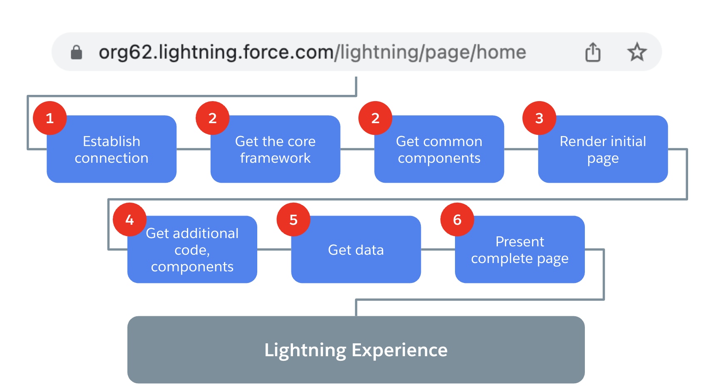
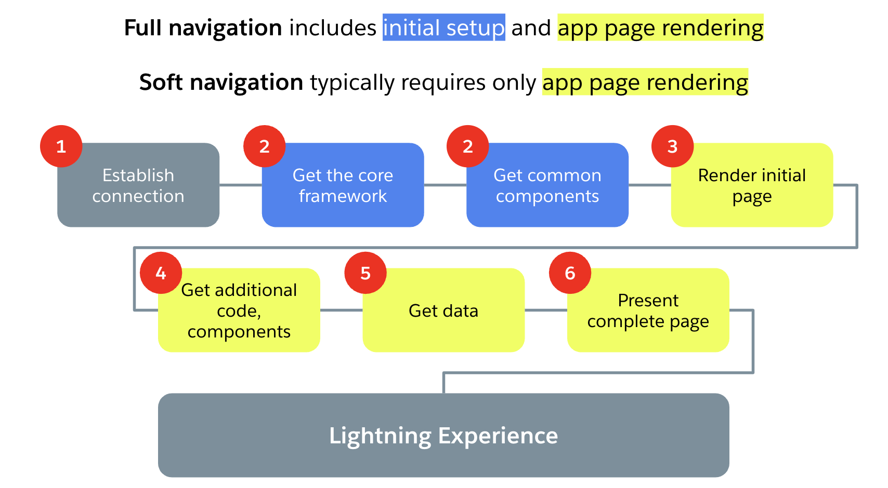
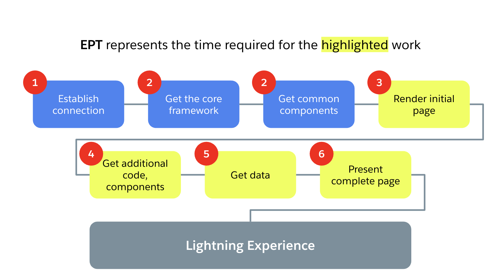

> 📝 This post, written by [Bogdan Brinza](https://www.linkedin.com/in/bogdan-brinza/) and myself, was originally published on the Salesforce developer blog: [link](https://developer.salesforce.com/blogs/2023/03/lightning-experience-with-lightning-speed-are-we-there-yet)

When website performance is great, it’s invisible and everything feels frictionless. But when performance is impacted, it hits the overall experience _hard_. With that in mind, we all know that Lightning Experience has had some [areas of opportunity](https://ideas.salesforce.com/s/idea/a0B8W00000GdcZVUAZ/lightning-experience-lex-lightning-speed-please) for improvement. We extend a big THANK YOU to all of you who shared your thoughts and feelings about Lightning Experience performance in IdeaExchange. We have read each of your comments, and you’ve motivated us to try something new.

In this post, we’d like to give you a closer look into the current state of Lightning Experience performance. We’ll share hard data, discuss our current areas of investment, and outline the next steps on this journey. After all, we want Lightning Experience to have lightning speed as much as you do!

## What’s going on behind Lightning Experience?

So what happens after a user types a URL into the browser navigation bar and presses “Enter”? Let’s take a look.

We’ll start by laying out the key steps that must occur to produce a Lightning Experience page. (This is an optional, Lightning Experience 101 overview, by the way. If you feel you won’t learn anything new, feel free to skip this section and jump to the next one).

While breaking apart the overall flow, it’s important to note that Lightning Experience is an SPA (single-page web application). It uses client-side rendering of Aura and LWC components, as opposed to Salesforce Classic, which uses server-side rendering and Visualforce components.

Keeping that in mind, here’s what the client browser does when a user initiates navigation:

And here are some more details on the steps required to produce Lightning Experience page as presented in the diagram above:

1.  Establish initial connection to a Salesforce data center
2.  Download initial HTML, CSS, and JavaScript with the core framework and the most common Aura and LWC components
3.  Use client-side rendering to build the application chrome (initial layout) and remove the loading screen
4.  Download additional code and components specific to the page
5.  Request data to display in the components while enforcing access and security
6.  Start progressively rendering the app page as more data arrives, and wait for further user input

After the initial navigation, one of the following is most likely to happen.

As noted in the diagram above, the user can likely do one of the following:

- Perform an action that requires **full navigation** (repeating steps 2 to 6 above), e.g., switch applications in the App Launcher
- Click somewhere on the app page to initiate **soft navigation** (repeating steps 3 to 6 above), e.g., navigate to a record
- Abandon the app, e.g., close the tab

And that’s it.

## Measuring Lightning Experience performance

As you might know, Salesforce uses a metric called [Experienced Page Time](https://help.salesforce.com/s/articleView?id=xcloud.technical_requirements_ept.htm&type=5) (EPT), which measures the time it takes for a page to load entirely.

This graphic gives an idea of what EPT measures:

To track the performance of Lightning Experience across Salesforce, we use a dashboard to aggregate production metrics from all Lightning Experience page views. As of the [last publicly available release](https://help.salesforce.com/s/articleView?id=release-notes.salesforce_release_notes.htm&release=242&type=5), our globally measured P50 (median) EPT is reported as 1.0 second.

According to the HTTP Archive, [average page loading](https://httparchive.org/reports/loading-speed) metrics fall in the range of two to seven seconds. If Lightning Experience loads pages in one second — _several times faster than average_ — then why does it need to get even faster?

When we started questioning our assumptions, we realized that we needed to take a user-centric point of view and start looking at the data that better reflects _user perception of page load time_.

In order to do that, we looked at the data previously _not_ reported as part of EPT:

- All the work required for full navigations; basically, the page load time as perceived by the end user when they start Lightning Experience
- Page load data coming from _problematic_ navigations that took longer than a certain threshold that was previously excluded

Additionally, we’ve been taking a more detailed look at segmentation to focus on the more problematic segments, not just the averages:

- Desktop vs mobile users
- Amount of customization and “implementation complexity”

Last, but not least, we’re enhancing the data itself:

- In addition to looking at P50 data (at least 50% of navigations would be slower than that value), we’re now tracking P75 data (at least 25% of navigations would be slower than that value) to better reflect _worse experiences_.

> Once those changes were implemented on the Performance dashboards, we saw that the Lightning Experience page load duration for _full_ _navigations_ would be a P50 of about four seconds and P75 of about seven seconds. This gets even worse for organizations with complex implementations reaching P75 of more than 10 seconds in some cases. Ouch.

Every solution starts with understanding and internalizing the problem. This data discovery exercise confirmed the urgency of improving Lightning Experience page loading performance for our users.

## Improving Lightning Experience performance

Seeing the problem clearly, and empowered by your feedback, we’ve put together a concrete plan for improvement over the next few releases.

To be clear, we’re focused on deep engineering investigations, profiling, and prototyping multiple options right now. As we discover new information, we might change some plans in order to get to our overall goals more efficiently. The list below represents our current thinking and focus, not necessarily the committed and detailed work.

We consider it vital that these improvements be as widespread as possible. As such, we are prioritizing solutions that will [elevate the platform for most of our customers](https://en.wikipedia.org/wiki/A_rising_tide_lifts_all_boats). More specific use cases might see additional improvement later. For now, we’re targeting improvements that should have a significant impact on the majority of users.

Our current plan of improvement covers the following key investments:

1.  Improve connectivity with better CDN utilization for core framework resources and enabling CDN for more users (see more details in our [blog post](https://developer.salesforce.com/blogs/2023/03/enable-cdn-to-load-lightning-experience-faster)).
2.  Reduce the payload size of the initial core framework, components, and styles. In addition to lowering the amount of data transferred, this should have a positive impact on the client devices if there is less code to compile and fewer styles to cascade.
3.  Enable prioritization of resource fetches to get initially visible content faster.
4.  Improve code cacheability.
5.  Reduce client-server “chattiness” for faster page loads and interactions.
6.  Continue our investment into components:
    1.  Support Dynamic Forms on additional entities
    2.  Make Dynamic Forms default for new orgs
    3.  Convert top five most-used Aura entities to LWC

Here is how the improvements from the list above would benefit Lightning Experience page construction steps:

## Conclusion

We’re excited to embark on this journey together with you, and today’s post is the start of a series focused on Lightning Experience performance, where we’ll go deeper into individual topics and improvements. In addition to keeping you informed about our progress, we’ll be sharing tips and tricks on the improvements you can achieve today, e.g., upgrading to the latest components improvements like Dynamic Forms that might bring page load time improvements up to 10%. Please stay tuned!

Meanwhile, don’t hesitate to contact us with your thoughts and feedback!
