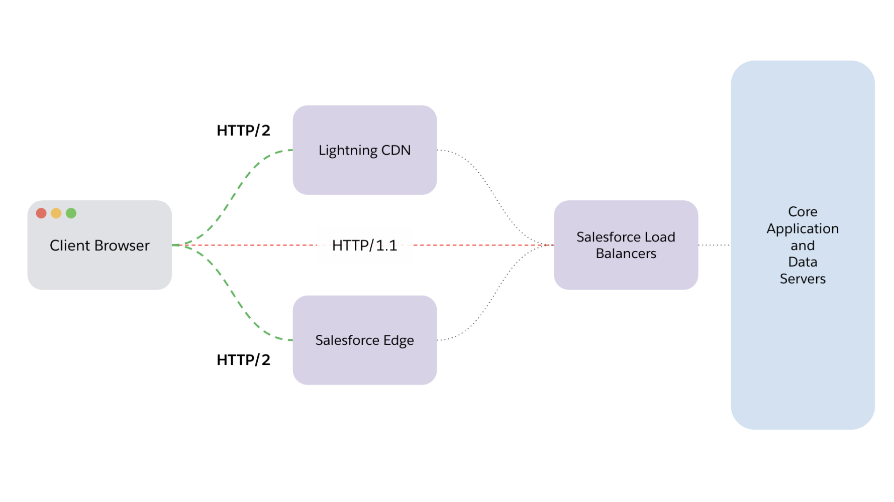

> 📝 This post, written by [Bogdan Brinza](https://www.linkedin.com/in/bogdan-brinza/) and myself, was originally published on the Salesforce developer blog: [link](https://developer.salesforce.com/blogs/2023/09/our-detailed-plan-to-improve-lightning-experience-performance)

Back in March, we gave a first glance at our effort to [improve Lightning Experience performance](/posts/2023/lex-with-lightning-speed). Now, we’d like to share a closer look at our plan and share the next level of details with you. We’re inviting you behind the curtain to share the complete cycle with you: the current state, opportunities we have uncovered, and our next steps. Based on the feedback we received from the first blog, many of you may appreciate this additional level of detail.

We’re in this together and would like to continue to partner with you on this journey. This post will give you a next-level understanding of what you can do, along with our efforts to enhance the experience.

Let’s get started! Broadly, we’ve broken down all our plans into four large groups:

- Increase concurrency
- Get less code faster
- Optimize layouts and components
- Prioritize critical data sooner

Below, you’ll find the mapping of those groups of work to the Lightning Experience page load sequence (Please refer to the [first post in the series](/posts/2023/lex-with-lightning-speed) if you need a refresher on those steps).

Let’s break down specific opportunities and the next steps we identified for each group.

## Increase concurrency

Establishing the network connection from the browser to Salesforce’s server (aka origin server) is a critical first step in building a Lightning Experience page and the overall user experience.

We’re dramatically simplifying the diagram to demonstrate user-to-origin server flow in this post — all the nuances of the Salesforce Networking Infrastructure and all the parts required to transport the data to support millions of daily users would require its own post!

That first hop (Salesforce Load Balancer, Lightning CDN, Salesforce Edge) heavily influences the rest of the experience as the best protocol available between client and server would define the number of concurrent connections available in a browser.

| Opportunity                                                              | Planned solution                                                                                                                                        |
| ------------------------------------------------------------------------ | ------------------------------------------------------------------------------------------------------------------------------------------------------- |
| For most organizations today, the first hop would use HTTP/1.1 protocol. | We are exploring the best ways to enable HTTP/2 support for most of Salesforce customers, making more concurrent requests available to client browsers. |

Our planned solution — enabling [HTTP/2](https://developer.mozilla.org/en-US/docs/Glossary/HTTP_2) at the Salesforce scale — is not an easy or simple change. There are several alternatives being explored to make HTTP/2 more widely available, and we’ll share more details soon.

In the next sections of this blog post, we’ll describe how we’re considering taking advantage of HTTP/2 and improving code and component delivery.

## Get less code faster

Internally, when discussing a Lightning Experience page, we refer to the initial loading of the core Aura (Lightning) framework, along with the required components, as the “bootstrap” process.

That process is universal for all Lightning Experience apps and is processed on every (full) navigation.

Whether you’re navigating to the Sales Cloud Opportunity Record home or Service Cloud home page, the browser performs the following steps:

- Retrieves all the resources required to bootstrap the application (code, components, styles, app config, etc.) from the local cache or origin
- Processes those assets (more on that later)
- Starts constructing the requested page using client-side rendering

Any components used by that page that aren’t preloaded during the application bootstrap will be requested individually. The Aura framework (that Lightning Experience is built upon) was created almost a decade ago, and to mitigate browser limits back then, the system was designed to batch component requests using Aura “boxcar,” which combines individual requests into a single one.

It’s worth noting that most of the components today are delivered as JavaScript strings (literal JavaScript comments or part of a JSON payload) that, among other things, defeat [bytecode caching](https://v8.dev/blog/code-caching-for-devs) in modern browsers.

Let’s summarize all the opportunities that would allow us to modernize and improve the bootstrapping process:

| Opportunity                                                                                                | Planned solution                                                                                                                                                                                                                                           |
| ---------------------------------------------------------------------------------------------------------- | ---------------------------------------------------------------------------------------------------------------------------------------------------------------------------------------------------------------------------------------------------------- |
| Roughly 80% of the common components delivered during bootstrapping are not used on 80% of the page views. | Luckily for us, the industry has solved this exact problem with [bundling](https://web.dev/webpack/) (and component tree optimizations). Additionally we're looking to trim down the initial payload in the short-term, even before we introduce bundling. |
| Components are delivered as JavaScript comments and strings, not code.                                     | As part of our code delivery improvements, we're planning to transition from "code as comments" to "code as… code"                                                                                                                                         |
| Requesting additional components requires multiple network round-trips.                                    | Along with the bootstrap, we will be shipping a static map of the latest versions of first-party components, and we'll enable HTTP caching the LATEST version of the components that aren't part of the application bootstrap.                             |
| Certain first-party components are requested individually very frequently (millions of times per month).   | Frequently requested first-party components that are not part of the bootstrap will be added to it.                                                                                                                                                        |
| Parts of the core framework are represented by compatibility code for legacy (long unsupported) browsers.  | Following up on [Internet Explorer 11 deprecation](https://help.salesforce.com/s/articleView?id=release-notes.rn_supported_browsers_ie11.htm&release=230&type=5), we will remove all compatibility code.                                                   |
| Aura boxcarring mechanism needs to be rethought in HTTP/2-enabled environment.                             | We're planning to disable the Aura boxcarring mechanism for component delivery along with HTTP/2 enablement.                                                                                                                                               |

While most of the opportunities and solutions are self-explanatory, one change that might have implications for developer experience caused by caching is worth detailing.

### Avoiding redirects to the LATEST version of the components

There are two ways we’re planning to mitigate the need to perform a non-cacheable redirect and incur a non-trivial delay in waiting for the server to respond:

- Considering that the vast majority of components are first-party standard components that don’t change outside of patch releases, we’re planning to create a static map of the LATEST versions of the most frequently requested components (that are not requested frequently enough to be added to the initial payload).
- For all other components, we’ll be caching the LATEST version of a component with an HTTP cache with a TTL of five minutes (10 with [stale-while-revalidate](https://web.dev/case-studies/ads-case-study-stale-while-revalidate)). We will continue to tune this value in future releases.

## Optimize layouts and components

As part of our performance investments, we’re prioritizing the migration of entities and components from Aura to Lightning Web Components.

Here are specific opportunities and planned solutions for this area:

| Opportunity                                                                                           | Planned solution                                                                                                        |
| ----------------------------------------------------------------------------------------------------- | ----------------------------------------------------------------------------------------------------------------------- |
| Certain frequently used entities are not LWC.                                                         | Continue converting top remaining Aura entities to LWC.                                                                 |
| Certain frequently used components are not LWC.                                                       | Continue converting top remaining Aura components to LWC: Related Record, Path Assistant, Activity Timeline, Case Feed. |
| FlexiPages are generated on the server per user, limiting cacheability and reuse in the organization. | Transition FlexiPages to a user-agnostic model to dramatically improve cacheability.                                    |
| Certain standard components are relatively slow vs industry peers.                                    | Invest into improving performance for most used and slowest standard components, starting with DataTable.               |
| Reports are 3% of all Lightning Experience page views and consistently are above P75 page load times. | Invest in improving performance for Lightning Reports.                                                                  |

## Prioritize critical data sooner

Saving the best for the last, let’s take a look at the opportunities in the area of data delivery.

Among other things, data delivery provides all of the required metadata, and of course, the actual set of data depends on the specific page: [FlexiPage](https://developer.salesforce.com/docs/atlas.en-us.api_meta.meta/api_meta/meta_flexipage.htm) description; Related list, Object, and Layout information; Record actions and avatars; Record fields data.

When we analyzed our production data, we noticed that almost 50% of the P75 EPT for a page is idle waiting for the results of the previously requested XHR to come back.

This translated into several opportunities for us:

| Opportunity                                                                                                                                                      | Planned solutions                                                                                                                                                                                                                                        |
| ---------------------------------------------------------------------------------------------------------------------------------------------------------------- | -------------------------------------------------------------------------------------------------------------------------------------------------------------------------------------------------------------------------------------------------------- |
| Aura actions are limited to six concurrent with a boxcarring mechanism.                                                                                          | Increase the number of Aura actions along with HTTP/2 enablement.                                                                                                                                                                                        |
| Aura actions are practically unlimited on the server. While not common, certain pages use thousands of Aura actions, making the experience slower for everybody. | Limit Aura actions to 1250 per page (or lower) on the server, limiting impact of the outliers on the rest of the users.                                                                                                                                  |
| Most of the data is delivered sequentially, even when it's not dependent on previous requests.                                                                   | Preload as much data as possible as soon as we can, potentially along with the code.                                                                                                                                                                     |
| In many cases, record fields are delivered in small batches (to hydrate component by component).                                                                 | Investigate opportunities to get record fields data more efficiently in fewer numbers of requests (to minimize client/server transactional costs).                                                                                                       |
| Our production data shows that only 10% of the page navigations result in a user action, and there's no need to eagerly load them all.                           | Investigate opportunities to defer loading platform actions metadata until user invokes an action.                                                                                                                                                       |
| Components under hidden tabs and in many standard containers are still requesting data to be rendered, even if they're not visible yet.                          | Leverage progressive page rendering containers for hidden tabs and more component containers to defer requesting data and rendering "below the fold" content, and enable getting the most critical data as soon as possible.                             |
| Local encrypted Aura actions cache is too small and overly aggressive at removing all contents, resulting in very low hit rate.                                  | We're investing into modernizing and increasing the size of the local encrypted Aura actions cache to dramatically increase cache hit rate.                                                                                                              |
| Local encrypted Aura actions cache has a very short TTL (Time to Live).                                                                                          | We're investigating various strategies to improve cache hit rates (see above), and as part of that effort, we will experiment with optimizing TTL and potentially implement "[stale-while-revalidate](https://web.dev/stale-while-revalidate/)" pattern. |

## Planned timeline

We believe that combining the above-mentioned changes will have a transformative effect on the Lightning Experience page loading times and critical interactions.

We can’t wait for you to experience those changes! Let’s talk about the timeline we’re targeting:

We’re taking a careful and measured approach to rolling out large architectural changes planned in this effort. At the end of the day, you need Salesforce to remain available and _then_ to become faster.

For every feature, we’re generally using the following step-by-step sequence:

1.  Prototype the change to validate our hypothesis
2.  Implement the change with production quality
3.  Run the change through the Performance Lab, validate improvements, and prevent regressions in other areas
4.  Deploy the change to production first on Salesforce-managed orgs (Salesforce runs on Salesforce!)
5.  Deploy the change to sandboxes
6.  Carefully roll out the change to all production orgs

Of course, all the previous steps need to be completed positively in order for us to progress to the next step. We’re using a [fail-fast](<https://en.wikipedia.org/wiki/Fail_fast_(business)>) approach, and if something does not meet our expectations, we’re moving on — there’s no shortage of opportunities for us to explore!

Additionally, we’re attempting something new with this effort. We’re hoping to start back-porting the most meaningful and safe changes to the current release (current, as opposed to “the next release” that’s in development), so that you won’t have to wait too long to start experiencing the improvements.

It’s important to note that, ultimately, we’re talking about _engineering plans,_ and those plans could change due to factors we can’t control. We might have to adjust the scope or find alternative strategies to solve the opportunities we found. But rest assured — even if our plans change, our intention to improve performance and user experience won’t change!

We’re hoping that you’re as excited as we are, and we look forward to sharing the results of our work starting with the next post in this series.

## Thank you to our contributors

This post would not have happened without contributions from these amazing individuals (listed in alphabetical order): Aaron Burns, Ahmed Ghanem, Andrew Huffman, Donna Thomas, Eric Perret, Joan Wang, Mandy Ball, Martin Presler-Marshal, Onkar Mayenkar, Nolan Lawson, Shrenik Shah, and Kevin Hill.

## Resources

Want to learn more about how we’ve started on our Lightning Performance journey? Check out the first blog in this series:

- [Lightning Experience with Lightning Speed (Are We There Yet?)](/posts/2023/lex-with-lightning-speed)

Looking for resources to get started with Lightning Performance? Check out the following Trailhead modules:

- [Performance Troubleshooting in Lightning Web Components](https://trailhead.salesforce.com/content/learn/modules/performance-troubleshooting-in-lwc)
- [Lightning Experience Performance Optimization](https://trailhead.salesforce.com/content/learn/modules/lightning-experience-performance-optimization)

Want to chime in with support for this effort? Consider upvoting [this IdeaExchange idea](https://ideas.salesforce.com/s/idea/a0B8W00000GdcZVUAZ/lightning-experience-lex-lightning-speed-please)!
