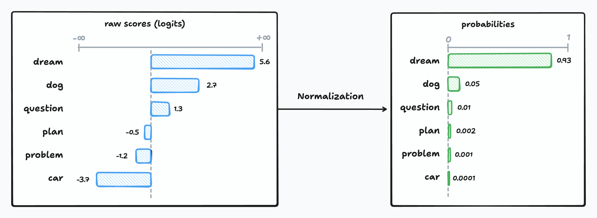
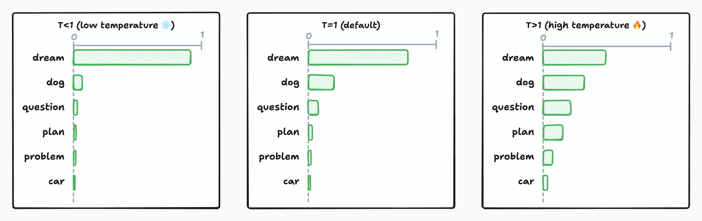
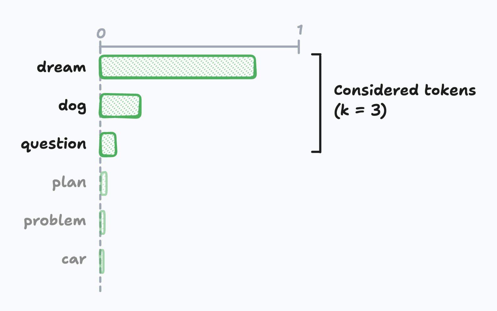
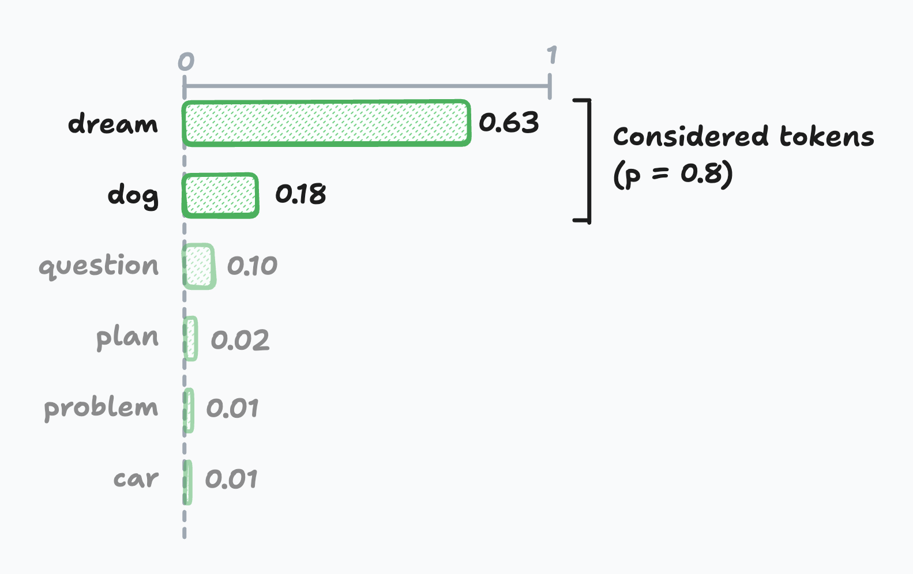

Ask the same question twice to any LLM and you'll get two similar yet subtly different responses. As software engineers without formal ML backgrounds and with limited knowledge of neural networks, the underlying mechanics can feel like magic.

You've probably seen advice like _"Use a low temperature to make the output deterministic"_ from one of those popular prompt engineering guides. These sound like old family recipes passed down through generations of AI engineers.

But here's the thing: it's actually more straightforward than I originally expected!

This article should give you a solid intuition for how these models select tokens, and how parameters like `temperature`, `top-k`, and `top-p` influence the generated output. It doesn't go into the inference details, so if you're interested in the inner workings of the transformer architecture, sorry to disappoint; you can now close this tab.

Let's get ourselves warmed-up with a recap on how LLM work.

## One token at a time...

Modern LLMs generate text one token at a time, using previously generated tokens as context for the next prediction. These are called **autoregressive models**. You can think of them as recursive functions that build results incrementally.

LLMs don't directly manipulate raw text. Instead, LLMs operate on **tokens**. Tokens can represent words, word chunks, punctuation, or even special control sequences for tool calls or end-of-text markers. Each token maps to a unique identifier.

Each model has a predefined set of tokens it understands, established during training. The set of all possible tokens is called the model's **vocabulary**. Modern open-weight models like Llama 3 have vocabularies composed of 128K tokens, while closed-source models exceed 200K.

## The Text Generation Pipeline

At a very high level, the LLM text generation pipeline breaks down into four distinct stages:

**Stage 1 - Tokenization:** The input text is converted into a token sequence. This step is fairly straightforward as it primarily consists of simple string manipulation and searching for the correct token in a lookup table.

**Stage 2 - Inference:** This is where the magic of the transformer architecture resides, and it's where the heavy lifting occurs. Given an input sequence of tokens, the LLM's core model computes a "score"—also called a logit—for every possible next token in its entire vocabulary. The higher the score, the greater the likelihood of seeing that specific token next in the sequence.

**Stage 3 - Decoding:** Based on the logits generated in the inference step, a decoding algorithm selects the actual next token. This selection isn't always about picking the highest-scoring token; sometimes, a bit of controlled randomness is introduced to spark "creativity".

**Stage 4 - Detokenization:** Once the next token is selected, it's converted back into human-readable text. As its name indicates, it's doing the reverse operation of the first stage.

### A few key insights

Understanding this pipeline helped me clarify some misconceptions I had about how LLMs work. Here are the insights that clicked for me:

**The inference stage doesn't pick tokens—it scores them.** I originally thought that the inference stage was in charge of selecting the next token, but that's not the case in practice. The inference phase produces a logit for each token in its vocabulary. If the model has a vocabulary composed of 128K tokens, the output layer produces a vector of 128K real values. Conceptually, it's like assigning a likelihood factor to all possible words in the dictionary every time we want to complete a sentence. At this stage, all potential tokens are still considered; they're just weighted with different scores.

**Most of the process is deterministic.** I find it fascinating that the vast majority of this generation process is _mostly_ deterministic. Tokenization and detokenization are deterministic by design. But more surprisingly, given the same input sequence, the inference phase always produces the same logits. The randomness in text generation is introduced during the decoding phase.

**You only have limited control over the decoding.** As a developer, it's important to understand what you have control over. Major hosted LLM providers only expose parameters that influence the token selection in the decoding phase. You have no control over the (de)tokenization process or the inference. All the creative parameters you can tweak affect how the final token is selected from those pre-computed scores.

For the rest of the article, we will focus on the inner working of the decoding and how parameters influences the token selection.

## Decoding strategies

There are many ways to approach decoding. The most naive approach would be to always pick the most likely token each round. This approach is called **greedy search**. It turns out that the generated output is suboptimal. It's quite repetitive because of its deterministic nature. This is the reason why conversational LLMs introduce some randomness in the token selection process.

This section contains some math equations, but bear with me. We'll go over each concept step by step.

### From Scores to Probabilities: The Softmax Function

Before we can select a token, we need to convert those raw logit scores into probabilities. During inference, the model outputs logits for every token in its vocabulary—values that can range anywhere from negative infinity to positive infinity. To make sense of these scores, we need to normalize them into a proper probability distribution where each value falls between 0 and 1, and all values sum to exactly 1.

The most straightforward approach would be simple division—take each logit score and divide it by the sum of all logits:

$$
\text{normalized}(z_i) = \frac{z_i}{\sum_{j=1}^{n} z_j}
$$

This seems reasonable, but it falls short in practice for two important reasons. First, it only works with positive values, yet logits can be negative. Second, this approach has an unintended side effect: it tends to flatten the probability distribution when logit values are large. Here's what I mean:

| Logits            | Simple Normalization |
| ----------------- | -------------------- |
| `[10, 11, 12]`    | `[0.27, 0.33, 0.36]` |
| `[100, 101, 102]` | `[0.33, 0.33, 0.34]` |

To solve these problems, LLMs use the **softmax function**. It's the standard normalization technique in machine learning and works similarly to simple division, but with a crucial twist that each logit is exponentiated before normalization:

$$
\text{softmax}(z_i) = \frac{e^{z_i}}{\sum_{j=1}^{n} e^{z_j}}
$$

Now let's compare both approaches using our previous example:

| Logits            | Simple Normalization | Softmax              |
| ----------------- | -------------------- | -------------------- |
| `[10, 11, 12]`    | `[0.27, 0.33, 0.36]` | `[0.09, 0.24, 0.67]` |
| `[100, 101, 102]` | `[0.33, 0.33, 0.34]` | `[0.09, 0.24, 0.67]` |

The softmax produces identical outputs for both rows, even though the logit values are completely different. This demonstrates the softmax function's translation invariance. Shifting all values by the same amount doesn't change the final probabilities.

More importantly, softmax preserves the relative differences between scores. It acts as a "soft argmax", amplifying the highest-scoring tokens while still maintaining a valid probability distribution where all values sum to 1.

### `temperature`: The Creativity Dial

Now we get to the fun part—controlling creativity! The magic of LLMs comes from occasionally selecting less likely tokens instead of always picking the most probable one. This behavior is controlled by the **`temperature` parameter**, which modifies our softmax function:

$$
\text{softmax}(z_i) = \frac{e^{z_i/T}}{\sum_{j=1}^{n} e^{z_j/T}}
$$

Think of temperature as your creativity dial. Here's how it works:

- **T < 1** (Low temperature ❄️): Sharpens the probability distribution, making high-probability tokens even more likely. Output becomes more predictable and deterministic.
- **T = 1** (Default): No modification to the probabilities. This is what most providers use as their baseline.
- **T > 1** (High temperature 🔥): Flattens the probability distribution, giving lower-probability tokens a better chance. Output becomes more creative and unpredictable.

As temperature approaches zero, the model always picking the most likely token. Which is effectively equivalent to **greedy search**. While being entirely deterministic on paper, floating-point precision and implementation details can still introduce tiny variations.

Provider constraints on the temperature value vary between provider. OpenAI and Google allow temperatures from 0 to 2, while Anthropic restricts it to 0 to 1. Interestingly, while most providers default to temperature 1, Ollama defaults to 0.8. On top of this individual models can override these defaults through their [`Modelfile`](https://github.com/ollama/ollama/blob/main/docs/modelfile.md#basic-modelfile) configuration.

### `top-k` Sampling: Limiting the Playing Field

Sometimes even with `temperature` control, you want to completely eliminate unlikely tokens from consideration. That's where **`top-k` sampling** comes in—it restricts token selection to only the K most probable tokens, effectively removing the "long tail" of options that might produce nonsensical output.

Here's how it works: if `k=3`, the model can only choose from the three top tokens, ignoring all other possibilities regardless of their actual probabilities. The probability mass gets redistributed among these top-k tokens, and then the selection happens normally.

The challenge is finding the correct value for k. Set it too small, and you might discard good options when probabilities are evenly distributed. Set it too large, and you might include poor choices when probabilities are heavily skewed toward a few tokens.

_Note: OpenAI's API doesn't expose top-k, but Google and Anthropic do._

### `top-p` Sampling: Adaptive Token Selection

**`top-p` sampling**, also refered to as nucleus sampling in the literature, takes a different approach than `top-k` by using a cumulative probability threshold instead of a fixed number of tokens. The model selects from the smallest set of tokens whose cumulative probability exceeds the threshold p.

For example, if `p=0.8`, the model considers tokens until their cumulative probability reaches 80%, then selects from that set. This approach naturally adapts to different probability distributions.

When probabilities are uniform (spread out), it includes more tokens to reach the 80% threshold and when probabilities are skewed (concentrated), it focuses on fewer, high-probability tokens.

Top-p values should be between 0 and 1, where 1 has no effect on sampling (includes all tokens). While adaptive nature makes top-p often more practical than top-k for real-world applications, setting a correct p value requires trails and errors.

## Putting It All Together

While not typically recommended, temperature, top-k, and top-p can be combined. They're usually applied in this order:

1. **Temperature scaling**: Adjust the probability distribution
2. **Top-k and top-p filtering**: Limit the candidate token set
3. **Renormalization**: Ensure probabilities sum to 1 for the filtered set
4. **Random sampling**: Select the final token using a random number generator

## Conclusion

So there you have it—the mystery behind LLM text generation isn't so mysterious after all! The key insight is that LLMs are mostly deterministic machines. All the randomness and creativity you see comes entirely from the decoding step, not from the core model computation. Once you understand this, those cryptic parameters start making sense: `temperature` is your primary creativity dial (low for consistency, high for creativity), while `top-k` and `top-p` provide additional fine-tuning by filtering the candidate token set before selection.

Understanding these mechanics gives you better intuition for prompt engineering and helps you make informed decisions about when and how to adjust generation parameters for your specific use cases. If you want to go deeper, many LLM providers expose the underlying probability distributions through `logprobs` parameters—this opens up creative possibilities for classification tasks, confidence scoring, and quality assessment. Check out [OpenAI's logprobs cookbook](https://cookbook.openai.com/examples/using_logprobs) for practical examples of what's possible when you peek under the hood.
