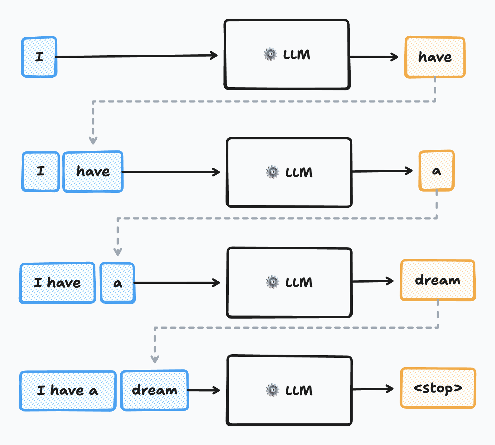
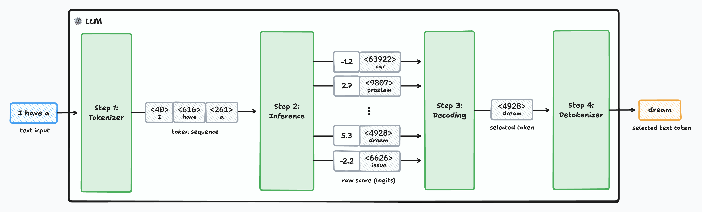

Ask the same question twice to any LLM and you'll get two similar yet subtly different responses. As software engineers without formal ML background and with limited knowledge of neural network, the underlying mechanics can feel like magic.

You've probably seen advice like _"Use a low temperature to make the output deterministic"_ from one of those popular prompt engineering guides. These sound like old recipes passed down through generations of AI engineers because I lack the mental model on how those parameters affects the generated output. But here's the thing; it's actually more straightforward than I originally expect!

This article should have a solid intuition for how these models select their tokens, and how parameters like `temperature`, `top-k`, and `top-p` influence the generated output. This doesn't goes into the inference details do if you are interested in the inner-working of the transformer architecture, sorry to disappoint you but this article isn't meant for you.

## One token at a time ...

Modern LLMs generate text one token at a time, using previously generated tokens as context for the next prediction. These are called **autoregressive models**. You can think of them as recursive functions that build results incrementally.



LLMs don't directly manipulate raw text. Instead, LLMs operate on **tokens**. Token can represent words, word chunks, punctuation, or even special control sequences for tool calls or end-of-text markers. Each token is defined by its unique identifier.

Each model has a predefined set of tokens it understands, established during training. The set of all the possible tokens is called the model's **vocabulary**. Modern open weight models like Llama 3 have vocabularies composed of 128K tokens, while closed-source models exceed 200K.

Now that we have a better understanding of primitives LLM manipulates, let open the hood to see what is going on.

## The LLM inner workings

The LLM text generation pipeline breaks down into four distinct stages:



**Stage 1 - Tokenization:** The input text is converted into a token sequence. This step is fairly straight forward as it primarily consists of simple string manipulation and searching the correct token in a lookup table.

**Stage 2 - Inference:** This is where the magic of the transformer architecture resides, and it's where the heavy lifting occurs. Given an input sequence of tokens, the LLM's core model computes a "score" — also called logit — for every possible next token in its entire vocabulary. The higher the score is, the greater the likelihood to see the specific token next in the sequence.

**Stage 3 - Decoding:** Based on the logits generated in the inference step, a decoding algorithm selects the actual next token. This selection isn't always about picking the highest-scoring token; sometimes, a bit of controlled randomness is introduced to foster creativity.

**Stage 4 - Detokenization:** Once the next token is selected, it's converted back into human-readable text. As it's name indicates it is doing the reverse operation as the first stage.

With this being said, here are a couple of insights that help me better understand this process:

I originally through that the inference stage was in charge of selecting the next token, but it's not the case in practice. The inference phase produce a logit for each token in its vocabulary. If the model has a vocabulary size of 128K tokens, the output layer of the inference phase produce a vector of 128K real value.

Conceptually it's like assigning a likelihood factor to all the possible words in the dictionary every time we want to complete a sentence. At this stage all the potential tokens are still considered; they are just weighted with different score. It's only during the decoding phase that a token is selected.

I also find it fascinating that vast majority of this generation process is _mostly_ deterministic. It is expected that the tokenization and detokenization are deterministic. But given the same input sequence, the inference phase always produce the same logits. The randomness in this process is introduces during the decoding phase.

I also think it's important to understand what you as a developer has control over. Major Hosted LLM provider like OpenAI or Anthropic only expose parameters that influence the token-selection distribution in the decoding phase. You have no control over the tokens or the inference.

## Decoding stategies

There are many ways to approach decoding. The most naive approach would is to always pick the most likely token each round. This approach is called a **greedy search**. It turns out that the generated output is suboptimal it is quite repeative.

### From Scores to Probabilities: The Softmax Function

During inference, the model outputs logits for every token in its vocabulary. These values can range from negative infinity to positive infinity. To select the next token, those values needs to be normalized to a probability distribution first where each value should be in the `[0, 1]` range and where the sum equal to `1`.


The section contains some math equations, but bare along with me. We will go over each of them step by step.

The most straightforward, but naive, way to normalize each value is to divide each score with the sum of the other logits.

```
normalized(z_i) = z_i / Σ(z_j)
```

However this approach falls short for 2 reasons among other:

- It only works with positive values. However it not the case, logit can be negative.
- This naive approach has the tendency to soften the difference between values when the logit value increase.

Let's take the following logits as example:

- `[10, 11, 12]` -> simple normalization -> `[0.27, 0.33, 0.36]`
- `[100, 101, 102]` -> simple normalization -> `[0.33, 0.33, 0.34]`

To solve the issues, LLMs are using the **softmax function**. It is often used in machine and closely resemble to the "simple normalization" with the key difference that each logit is exponentied.

```
softmax(z_i) = e^(z_i) / Σ(e^(z_j))
```

Let's take the same example as before and now apply the softmax function:

- `[10, 11, 12]` -> softmax -> `[0.09, 0.24, 0.67]`
- `[100, 101, 102]` -> softmax -> `[0.09, 0.24, 0.67]`

The above example exhibit and interesting aspect of the softmax function. When all the values are shifted with the value value, the softmax function produces the same output. This property in math is called translation invarience.

The softmax effectively acts as a "soft argmax" highlighting the most probable tokens while maintaining a valid probability distribution.

### Temperature: The Creativity Dial

The creative nature of LLMs comes from occasionally selecting less likely tokens. This behavior is controlled by the **temperature** parameter, which modifies the softmax function:

```
p_i = e^(z_i/T) / Σ(e^(z_j/T))
```

Think of temperature as a scaling function for the probability distribution:

- **T = 1**, which is the default value of most providers, it has no effect on the probability distribution.

- **T < 1**: Increases the gap between high and low probability tokens (more deterministic)
- **T = 1**: Default behavior (most providers use this)
- **T > 1**: Reduces the gap between probabilities (more creative/random)


Careful reader might have spotted that that as the temperature tends towards `0`, the decoding becomes like a **greedy search** which is fully deterministic. However, even setting temperature to `0` doesn't guarantee completely deterministic output due to floating-point precision and implementation details.

Most providers constrain temperature ranges. OpenAI & Google accepts are temperature in the `[0, 2]` range. When Anthropic restrict it further to `[0, 1]`.

While using `1` is the default temperature value for most LLM provider it is not the case for Ollama, with it's default being set to `0.8`. Indivudal models can override the default API temperature through [`Modelfile`](https://github.com/ollama/ollama/blob/main/docs/modelfile.md#basic-modelfile).

### Top-k Sampling: Limiting the Playing Field

Top-k sampling restricts token selection to only the K most probable tokens. This removes the "long tail" of unlikely options that might produce nonsensical output.


**Example**: If k=3 and the top tokens are ["the", "a", "an"], the model can only choose from these three, regardless of their actual probabilities.

**The challenge**: Setting K appropriately. Too small, and you might discard good options when probabilities are evenly distributed. Too large, and you might include poor choices when probabilities are heavily skewed.

_Note: OpenAI's API doesn't expose top-k, but Google and Anthropic do._

### Top-p Sampling: Adaptive Token Selection


Instead of a fixed number of tokens, top-p (nucleus sampling) uses a cumulative probability threshold. The model selects from the smallest set of tokens whose cumulative probability exceeds the threshold p.

**Example**: If p=0.9, the model considers tokens until their cumulative probability reaches 90%, then selects from that set.

This approach adapts better to different probability distributions:

- **Uniform distributions**: Includes more tokens
- **Skewed distributions**: Focuses on fewer, high-probability tokens

Top-p values should be between 0 and 1, where 1 has no effect on sampling.

## Putting It All Together

While not typically recommended, temperature, top-k, and top-p can be combined. They're applied in this order:

1. **Temperature scaling**: Adjust the probability distribution
2. **Top-k and top-p filtering**: Limit the candidate token set
3. **Renormalization**: Ensure probabilities sum to 1 for the filtered set
4. **Random sampling**: Select the final token using a random number generator

## Key Takeaways for Software Engineers

- **LLMs are mostly deterministic**: The randomness comes entirely from the decoding step, not the core model computation
- **Temperature is your primary creativity control**: Low values for consistency, higher values for creativity
- **Top-k and top-p provide additional control**: They filter the candidate set before selection
- **The heavy lifting is deterministic**: All the computational work happens in the predictable inference stage

## Going Deeper

Many LLM providers expose the underlying probability distributions through `logprobs` parameters. This opens up creative possibilities for classification tasks, confidence scoring, and quality assessment. Check out [OpenAI's logprobs cookbook](https://cookbook.openai.com/examples/using_logprobs) for practical examples.

Understanding these mechanics gives you better intuition for prompt engineering and helps you make informed decisions about when and how to adjust generation parameters for your specific use cases.

---

_The magic of LLMs isn't in their randomness—it's in how they learned to assign meaningful scores to tokens. The randomness just helps them avoid being boring._
