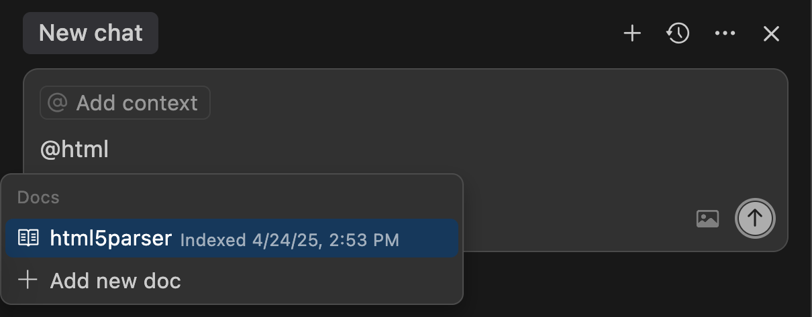

I really appreciate working in TypeScript. For me, developing with TypeScript feels like cycling on a road bike with training wheels: you get the agility and speed of JavaScript, with the added security of type safety.


However, adding TypeScript into a Node.js project traditionally introduced the overhead of setting up a build step and maintain a dedicated toolchain. And it's something that I usually avoid as I prefer to keep my side projects as low-maintenance as possible. Every added dependency means more code to manage in the long run, and each build step can introduce friction, slowing down the feedback loop. Consequently, I’ve often leaned towards a simpler stack: vanilla JavaScript, ES modules, using NPM for package manager, and Node.js's built-in test runner, carefully weighing the inclusion of each dependency.

## The Project: Highlight Hop

For the past few weeks, I've been developing a new side project: [Highlight Hop](https://highlighthop.dartus.fr/), an email-based bot designed to convert Amazon Kindle highlights and notes into open formats like Markdown, CSV, and JSON.

Beyond enhancing my reading experience on Kindle, I envisioned this project as a forcing function to challenge myself. Leverage AI models to build a high-quality application and deploy it to production with minimal manual coding.

After way too much time on the [r/cursor](https://www.reddit.com/r/cursor/) Reddit community to glean insights harness Cursors’ capabilities, I went ahead of got started:

1. Used reasoning model (OpenAI o3) to brainstorm and generate a [product requirements document](https://github.com/pmdartus/highlight-hop/blob/619513139454bd6c00fe099bddeae81454be9398/docs/product_brief.md) (PRD) including a high-level architecture.
2. Prompted the same reasoning model then broke down the PRD into smaller, manageable tasks, which were handed off to Cursor Agent with Claude 3.7 Sonnet.
3. Established a [Cursor rule](https://github.com/pmdartus/highlight-hop/blob/619513139454bd6c00fe099bddeae81454be9398/.cursor/rules/dev-flow.mdc) detailing the project structure, key scripts, and coding and testing conventions. This file would then be used by Cursor be injected into the context to ground the model.

This AI-driven workflow was incredibly effective…


…until the project grew. Things went smoothly when the entire codebase fit within a single file. However, as soon as I tasked the agent with refactoring the code into multiple files, hallucinations became more frequent. Even if the entire codebase could fit into Claude 3.7 Sonnet 200K context window bugs started to creep in.

Doubling down on unit tests and adopting a Test-Driven Development (TDD) approach resulted in slight improvements. This helped catch regressions introduced by the agent, but the fixes it generated were often of poor quality.

## TypeScript to the Rescue

While working on this project, I came to the realization my fear of maintaining a build pipeline to leverage TypeScript's benefits in a Node.js project is rapidly becoming a relic of the past. As of Node.js v22, "type stripping" is available behind a flag and, enabled by default in v23 (see the [official documentation](https://nodejs.org/en/learn/typescript/run-natively)).

With the build step effectively eliminated, my reservations about adopting TypeScript for this side project vanished. After a few iterations with Cursor's Agent to convert the project to TypeScript, I observed a step function in the generated code quality.

Cursor's "Iterate on lints" feature proved invaluable. When enabled, it captures errors flagged by the IDE—such as those from the TypeScript language server or ESLint plugin VS Code—and prompts the AI model to automatically rectify them.


In the same way that type safety allows human software engineer to work effectively without needing to hold the entire codebase in their minds, coding agents aren't always required to load the entire project into their context window to generate valid and coherent code.

## Polishing Your Types to Guide the AI

Even when an model generates valid code, it doesn't guarantee that the code is bug-free. Another lesson learned through this project is the importance of meticulously crafting types. Employing stricter typings that explicitly prohibit invalid states can significantly guide AI agents toward producing higher quality and more correct code.

Let me illustrate with a concrete example. A Kindle export consists of a list of user annotations, where each annotation can be either a note or a highlight.

The interface initially generated by the Claude Sonnet 3.7 model was functional but somewhat naïve:

```ts
interface Annotation {
  /** The type of annotation. */
  kind: "highlight" | "note";
  /** The location of the annotation in the book. */
  location: number;
  /** The user note. Required for notes and optional for highlights. */
  note?: string;
  /** The highlighted quote. Only present on highlight. */
  quote?: string;
  /** The highlight color. Only present on highlight. */
  color?: string;
}
```

A more robust way to represent this is by using a discriminated union of `Highlight` and `Note` types, where the `kind` property is defined as a string literal in each interface:

```ts
interface BaseAnnotation {
  /** The location of the annotation in the book */
  location: number;
}

interface Note extends BaseAnnotation {
  kind: "note";
  /** The note content. */
  note: string;
}

interface Highlight extends BaseAnnotation {
  kind: "highlight";
  /** The highlighted quote. */
  quote: string;
  /** The highlight color. */
  color: string;
  /** The user note attached to the quote if present. */
  note?: string;
}

type Annotation = Highlight | Note;
```

After I refined the type definitions, Cursor began generating more accurate code in fewer attempts. Thanks to these stricter typings, the agent could also self-correct more effectively when it made mistakes, using TypeScript's error messages. Furthermore, the AI model improved code coverage by eliminating impossible test cases—now disallowed by the new types—and generating new unit tests for relevant edge cases.

Without necessarily going all the way into "[hyper-typing](https://pscanf.com/s/341/)", investing a little time in **refining AI-generated types to better capture their semantics quickly pays dividends**.

## Building Infra with Types

Highlight Hop utilizes a serverless architecture deployed on AWS, relying on several key services:

- _SES (Simple Email Service)_ – for receiving and sending transactional emails.
- _S3 (Simple Storage Service)_ – as a temporary storage location for raw email messages.
- _Lambda_ – to transform Kindle exports into the requested formats and forward them to the sender.
- _SQS (Simple Queue Service)_ – a message queue system to notify Lambda functions.

Manually setting up and managing these services is incredibly tedious—it's no wonder services like Vercel or Netlify, which abstract these complexities away, are pricey.

To fully automate this setup, I decided to try [Pulumi](https://www.pulumi.com/). Pulumi is an Infrastructure-as-Code (IaC) tool, similar to Terraform, but with a key difference: infrastructure is described using general-purpose languages like TypeScript, Python, or Java, rather than a proprietary Domain-Specific Language (DSL).

For instance, the following Pulumi TypeScript snippet defines an AWS lambda function and an SQS queue and connects them together:

```ts
import * as aws from "@pulumi/aws";

// SQS email processing queue
const queue = new aws.sqs.Queue("email-queue");

// Lambda function for processing highlights
const lambda = new aws.lambda.Function("email-processor", {
  runtime: "nodejs22.x",
  handler: "index.handler",
  code: new pulumi.asset.AssetArchive({
    ".": new pulumi.asset.FileArchive("../dist"),
  }),
});

// SQS trigger for Lambda
new aws.lambda.EventSourceMapping("lambda-trigger", {
  eventSourceArn: queue.arn,
  functionName: lambda.arn,
});
```

My experience combining Pulumi and Cursor was extremely positive. Given the PRD and a few prompts, Cursor generated a remarkably good Pulumi script. It even tackled one of my main frustrations: defining the correct IAM roles and policies.

The fact that the infrastructure code is defined in TypeScript proved to be a significant advantage. Even though Pulumi might be less popular compared to Terraform, Cursor's Agent successfully pieced together the necessary configurations. When the AI hallucinated, the TypeScript type system forced rapid iteration and correction. There was no need for deployments to validate the script or to install additional VS Code plugins; the built-in TypeScript language server did most of the heavy lifting.

While I haven't conducted a formal side-by-side analysis, Pulumi's approach using general-purpose languages appears to yield better results with AI coding agents compared to Terraform's DSL, judging by recent feedback on the official [Terraform VS Code plugin](https://marketplace.visualstudio.com/items?itemName=HashiCorp.terraform&ssr=false#review-details) page.


## When Types Alone Aren’t Enough

The Kindle applications on iOS and Android export highlights as HTML documents with a predefined, albeit somewhat quirky, structure. To parse these documents, I selected the [`html5parser`](https://github.com/acrazing/html5parser) library.

While multiple high-quality HTML parsers are available on NPM—such as [`parse5`](https://github.com/inikulin/parse5), [`htmlparser2`](https://github.com/fb55/htmlparser2), or [`cheerio`](https://github.com/cheeriojs/cheerio)—I opted for `html5parser` because, you have guessed it, it's dependency-free. And yes, I need to work with my therapist on how to get over my fear of NPM dependencies.

However, `html5parser` is significantly less popular than its counterparts. A quick comparison of NPM weekly downloads reveals this disparity: `html5parser` 30K downloads, compared to 50M downloads for parse5.

This lower popularity had a noticeable impact the Agent capability. Even if `html5parser` shipes with type definitions, Cursor struggled to generate the parser logic. The AI frequently hallucinated, either using standard DOM APIs, borrowing APIs from other more popular parsing libraries.

Cursor's performance in this specific task improved dramatically after explicitly adding the `html5parser` documentation to its context using Cursor's `@-mentions` feature for documentation.



More details on using context like this can be found in the [official Cursor documentation](https://docs.cursor.com/context/@-symbols/@-docs).

## Types as an AI Enabler

My experience with Highlight Hop reinforces the benefits TypeScript, or any other strongly typed language, brings to the table in a world where an increasing amount of code is generated by models. Well-defined types act as guardrails and guides, not just for human developers, but for our AI partners too, leading to more robust, maintainable, and correct software, faster.

Reflecting back on the comparison between Pulumi and Terraform. One of the primary reasons for creating a Domain-Specific Language (DSL) has often been to make tools simpler for beginners to adopt. However, this typically comes at the significant with a high initial investment with building and maintaining an entire ecosystem around it (Language Server Protocol support, linters, CLIs, etc.). With generative AI lowering the bar for beginners, it is becoming apparent that toolchain relying on general purpose languages like TypeScript wich can tap on pre-existing ecosystem have a bright future in front of them.
